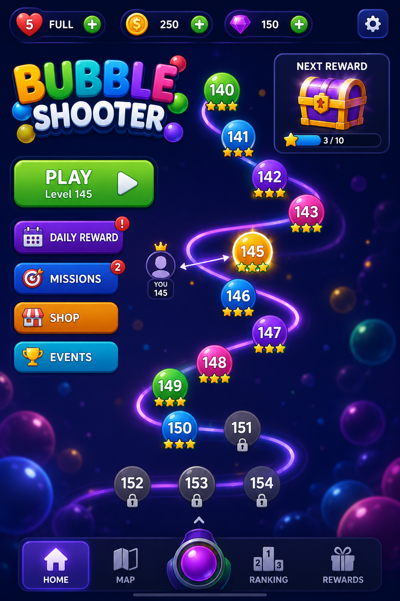
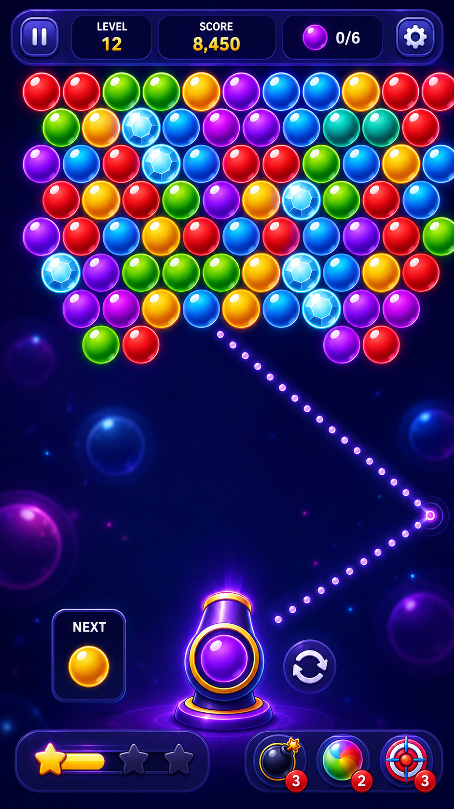

# Bubble Shoot

Bubble Shoot is a mobile-first HTML5 bubble shooter built with React, TypeScript, Vite, PixiJS, GSAP, and Howler. The game combines a canvas-based shooter with a typed gameplay engine, level progression, profile settings, audio, and a responsive app-style interface.

## Live Demo

[Play Bubble Shoot](https://bubble.linkskool.com)

## Overview

This project focuses on a polished casual-game experience for mobile browsers. Gameplay is rendered through PixiJS while React manages the surrounding screens, profile flow, settings, map, and HUD. The core rules are organized into small TypeScript modules for aiming, physics, grid logic, matching, scoring, level generation, and progression.

## Features

- Mobile-first bubble shooter gameplay
- PixiJS canvas rendering inside a React app shell
- Pointer/touch aiming with trajectory and snap resolution logic
- Hex-grid board model with collision, matching, floating-bubble removal, and scoring systems
- Curated and generated level support
- Mission objectives, shot budgets, star thresholds, and level progression
- Profile screen with avatar and country selection
- Local progress/profile persistence
- Home dashboard, level map, gameplay, settings, and profile screens
- Audio system using bundled sound assets and Howler
- Motion/effects presentation layer for gameplay feedback
- Unit tests for core game systems
- PWA files including manifest, icons, offline page/service worker assets

## Tech Stack

- React
- TypeScript
- Vite
- PixiJS
- GSAP
- Howler
- Vitest
- ESLint
- CSS
- LocalStorage

## Screenshots

The repository includes project screenshots:




## Architecture

The codebase separates the React UI from the game systems. Rendering and input live near the canvas host, while game behavior is split into focused TypeScript modules.

```txt
src/
  app/                    # App shell, preferences, error boundary
  components/             # Shared UI and canvas host
  config/                 # App configuration
  game/
    audio/                # Game audio controller
    catalog/              # Country/catalog data loading
    engine/               # Game loop
    floating/             # Floating bubble resolution
    generation/           # Generated level logic and validators
    grid/                 # Hex-grid coordinates and board utilities
    layout/               # Gameplay layout calculations
    levels/               # Level sessions, curated levels, level catalog
    map/                  # Progression map view helpers
    match/                # Match resolver
    mission/              # Mission runtime and registry
    physics/              # Projectile and collision logic
    presentation/         # Gameplay effect timelines
    profile/              # Player profile and avatar catalog
    progression/          # Save/progression repository
    rendering/            # Canvas drawing helpers and visual themes
    scoring/              # Turn scoring
    shooter/              # Aim, pointer input, shooter state, trajectory
    snap/                 # Snap resolver
    templates/            # Level templates
  screens/                # Home, map, gameplay, settings, profile screens
  styles/                 # Global styling
  utils/                  # Shared utilities
```

## Getting Started

### Prerequisites

- Node.js 22.12 or newer
- npm

### Installation

```bash
npm install
```

### Development

```bash
npm run dev
```

### Environment Variables

The app can run with its built-in default catalog endpoint. To override catalog settings locally, copy the example file:

```bash
cp .env.example .env.local
```

Available variables:

```txt
VITE_API_BASE_URL
VITE_API_KEY
VITE_ASSET_BASE_URL
```

Do not commit real API keys or production `.env` files.

## Available Scripts

```bash
npm run dev
```

Start the Vite development server.

```bash
npm run build
```

Type-check and create a production build.

```bash
npm run typecheck
```

Run TypeScript project checks.

```bash
npm run lint
```

Run ESLint.

```bash
npm test
```

Run the Vitest test suite.

```bash
npm run preview
```

Preview the production build locally.

## Deployment

The live project is available at:

[https://bubble.linkskool.com](https://bubble.linkskool.com)

This is a static Vite app. Build with:

```bash
npm run build
```

Deploy the generated `dist/` folder to a static hosting provider.

## License

MIT License. See [LICENSE](LICENSE).

## Future Improvements

- Add CI for typecheck, lint, tests, and production builds
- Review production environment variable handling before public releases
- Add route-level code splitting if bundle size becomes a deployment concern
- Add more README screenshots or a short gameplay GIF
